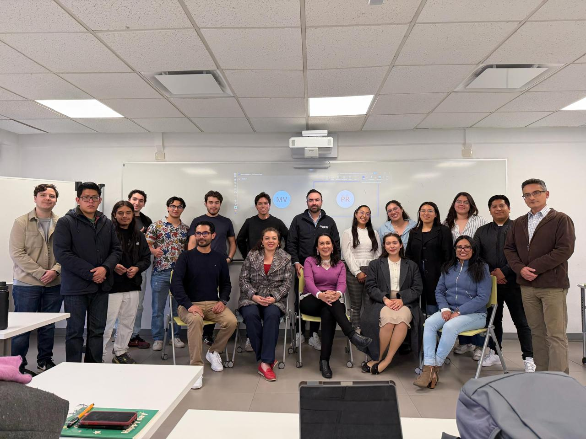
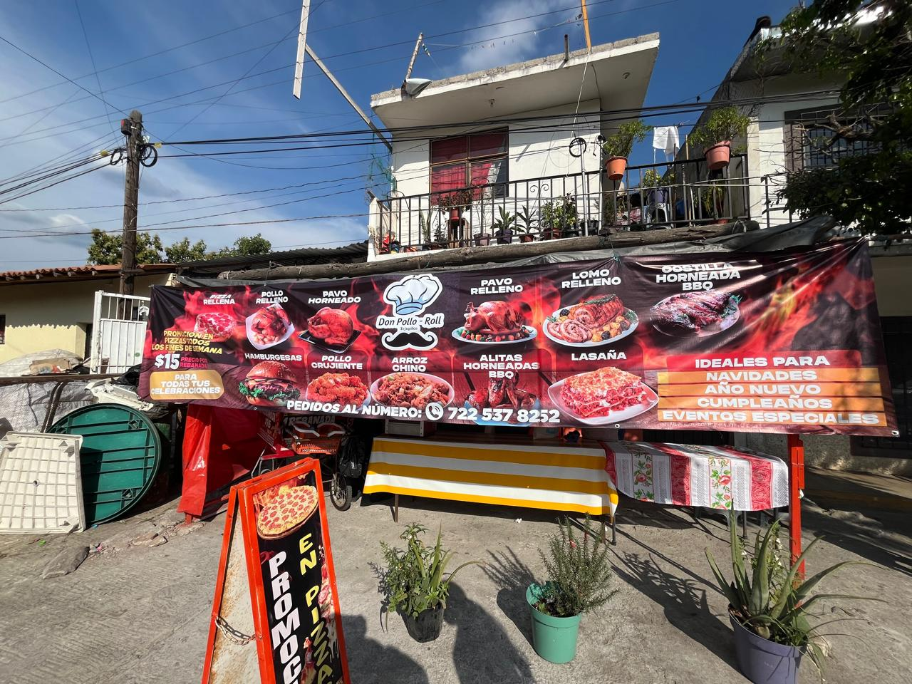

# Andrea Bahena Valdes

  <a href="./README.md">Leer en Español</a>

  
  
  

Professional profile focused on building technology solutions with strong operational impact: process automation, systems integration, and digital products that drive measurable business outcomes.

## Executive Profile

- Computer Science and Technology Engineering student, expected graduation in August 2026.
- Experience across business operations, EdTech, and digital transformation initiatives.
- End-to-end execution: analysis, architecture, implementation, and continuous improvement.
- Languages: Spanish (C2) and English (C1).

## Value Proposition

- Development of software that improves control, efficiency, and decision quality.
- Connection of business priorities with technically solid implementation.
- Collaboration across development, data, UX, cloud, and automation.
- Rapid adaptation to high-performance, cross-functional teams.

## Personal and Impact Projects

  
  

### Water Footprint and Rainwater Harvesting

Project for Bocar Fugra (Lerma) focused on rainfall prediction, scenario modeling, risk analysis, and implementation strategy for water management.

### Commerce Collusion Detection

A system for scenario registration, classification, interception, and prevention using emerging technologies.

### Personal Applied Research Line

Current work includes projects in **sensing plus supercomputing to reduce water stress in crops**, combining:

- Sensor data from soil, climate, and water availability variables.
- Large-scale predictive modeling and simulation.
- Irrigation strategy optimization for agricultural resilience and productivity.

## Technology Stack (Cards)

### Languages and Frameworks

  
  
  
  
  
  
  

### Cloud, DevOps, and Platforms

  
  
  
  
  

### Data and Tools

  
  
  
  

## Relevant Experience

- **Grupo Avante Textil (2025-2026)**: Analyst Programmer for web apps and integrations; project management systems, e-commerce control desk, and mobile order-picking app.
- **Grupo Pissa (2025)**: Hiring and onboarding system with authentication, document workflows, and cloud architecture.
- **MotorLeads (2024)**: UI design and API-driven data presentation for a car sales platform.
- **RedLingua (2022-2025)**: EdTech project support, team recruitment, and methodology development.

## GitHub Activity

  
  

## Contact

- Email: [andreabahenavs@gmail.com](mailto:andreabahenavs@gmail.com)
- Portfolio: [andrea-bahena-vs.vercel.app](https://andrea-bahena-vs.vercel.app)
- GitHub: [github.com/AndreaBaV](https://github.com/AndreaBaV)
- Resume: [Google Drive](https://drive.google.com/drive/folders/1XfEV07m8izVe8wdCuGFt-myAuqD62kfS?usp=sharing)

> "Don't watch the clock; do what it does. Keep going."
