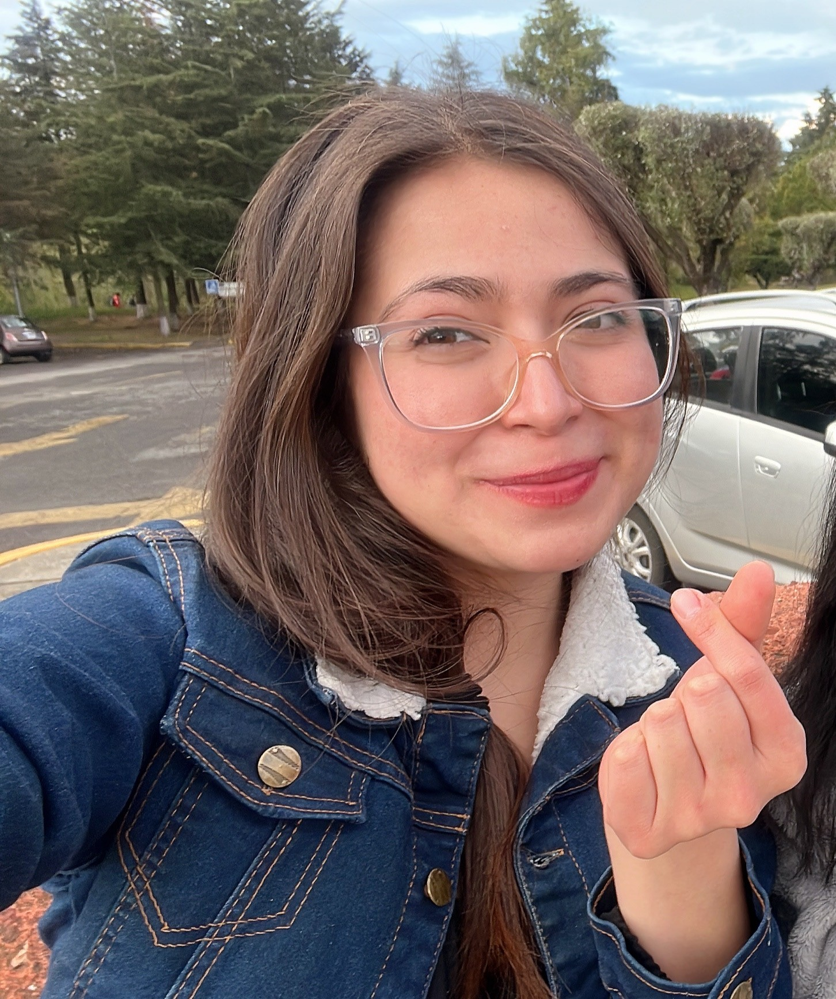
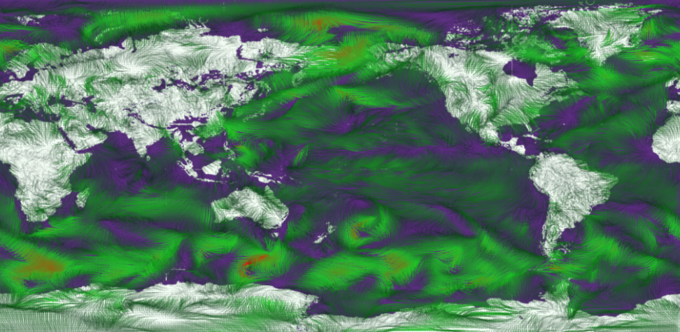
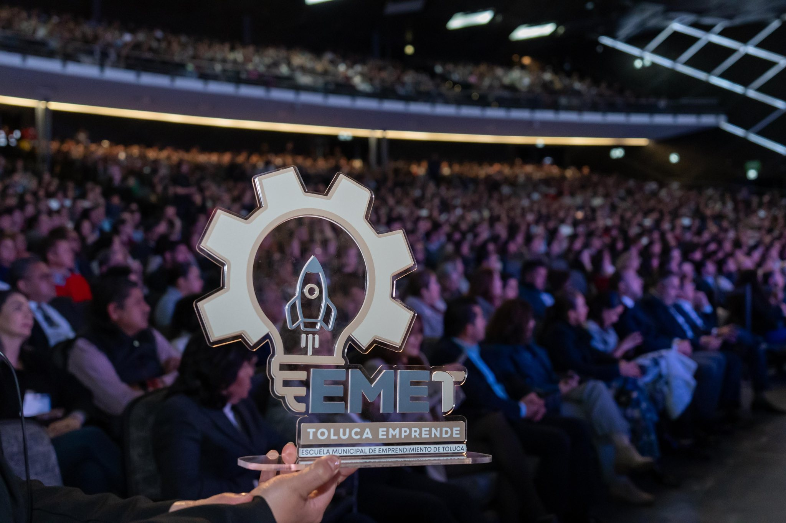
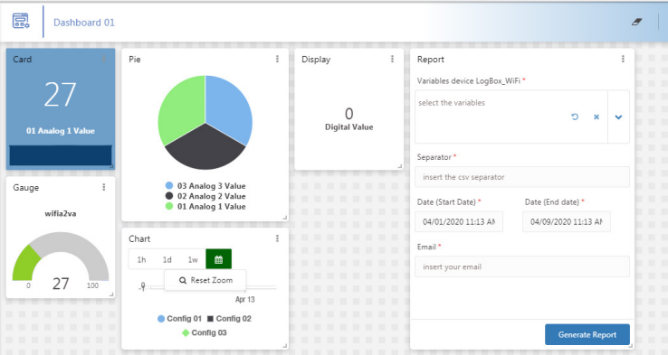
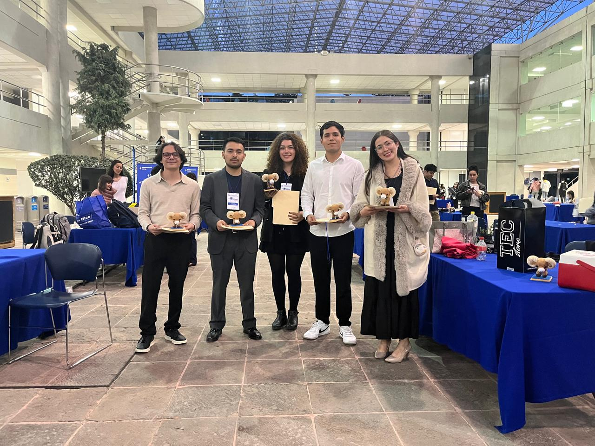
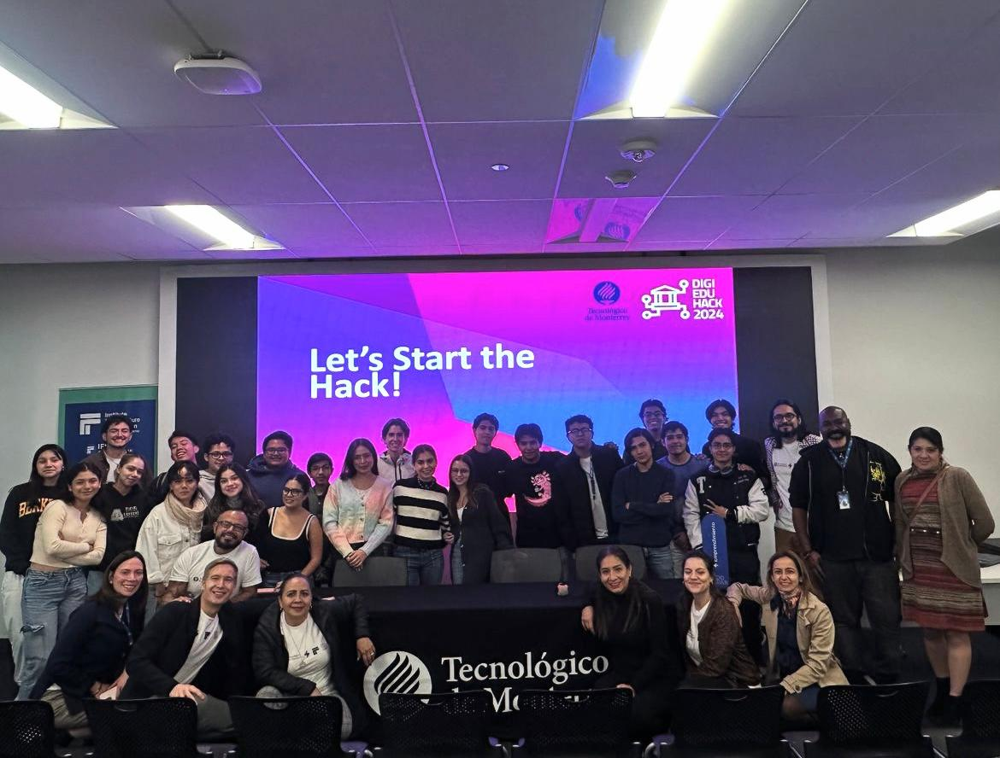

# Andrea Bahena Valdes

  <a href="./README.en.md">Read in English</a>

  
  
  

Perfil orientado al desarrollo de soluciones tecnológicas con impacto operativo real: automatización de procesos, integración de sistemas y productos digitales enfocados en resultados de negocio.

## Perfil Ejecutivo

- Ingeniera en Tecnologías Computacionales en formación, con graduación esperada en agosto 2026.
- Experiencia en entornos empresariales, EdTech y proyectos de transformación digital.
- Capacidad para llevar iniciativas de extremo a extremo: análisis, arquitectura, implementación y mejora continua.
- Idiomas: Español (C2) e Inglés (C1).

## Propuesta de Valor

- Diseño de software útil para operación, control y toma de decisiones.
- Vinculación de necesidades de negocio con ejecución técnica clara y medible.
- Integración de múltiples disciplinas: desarrollo, datos, UX, cloud y automatización.
- Adaptación ágil a entornos de alto rendimiento y colaboración interfuncional.

## Proyectos Personales y de Impacto

  
  

### Huella Hídrica y Captación Pluvial

Proyecto para Bocar Fugra (Lerma) enfocado en predicción de precipitación, modelado de escenarios, análisis de riesgo e implementación para gestión hídrica.

  

### Detección de Colusión en Comercios

Sistema de registro, clasificación, intercepción y prevención de escenarios de colusión con apoyo de tecnologías emergentes.

  

### Línea Personal de Investigación Aplicada

Línea activa de proyectos de **sensado con supercómputo para reducir el estrés hídrico en cultivos**, combinando:

- Sensores para variables de suelo, clima y disponibilidad de agua.
- Modelos predictivos de alta escala y simulación.
- Optimización de estrategias de riego para resiliencia y productividad agrícola.

### Collage Visual de Proyectos y Trayectoria

  
  

  
  
  

  
  

## Stack Tecnológico (Tarjetas)

### Lenguajes y Frameworks

  
  
  
  
  
  
  

### Cloud, DevOps y Plataforma

  
  
  
  
  

### Datos y Herramientas

  
  
  
  

## Experiencia Relevante

- **Grupo Avante Textil (2025-2026)**: Programadora Analista de aplicaciones web e integraciones; sistemas de gestión de proyectos, mesa de control e-commerce y app móvil para preparación de pedidos.
- **Grupo Pissa (2025)**: Sistema de contratación e inducción con autenticación, revisión documental y arquitectura cloud.
- **MotorLeads (2024)**: Diseño de UI y visualización de datos vía API en plataforma de venta automotriz.
- **RedLingua (2022-2025)**: Soporte en gestión de proyectos EdTech, reclutamiento y desarrollo metodológico.

## Contacto

- Correo: [andreabahenavs@gmail.com](mailto:andreabahenavs@gmail.com)
- Portafolio: [andrea-bahena-vs.vercel.app](https://andrea-bahena-vs.vercel.app)
- GitHub: [github.com/AndreaBaV](https://github.com/AndreaBaV)
- CV: [Google Drive](https://drive.google.com/drive/folders/1XfEV07m8izVe8wdCuGFt-myAuqD62kfS?usp=sharing)

> "Time is the greatest treasure allowed to humanity..."
